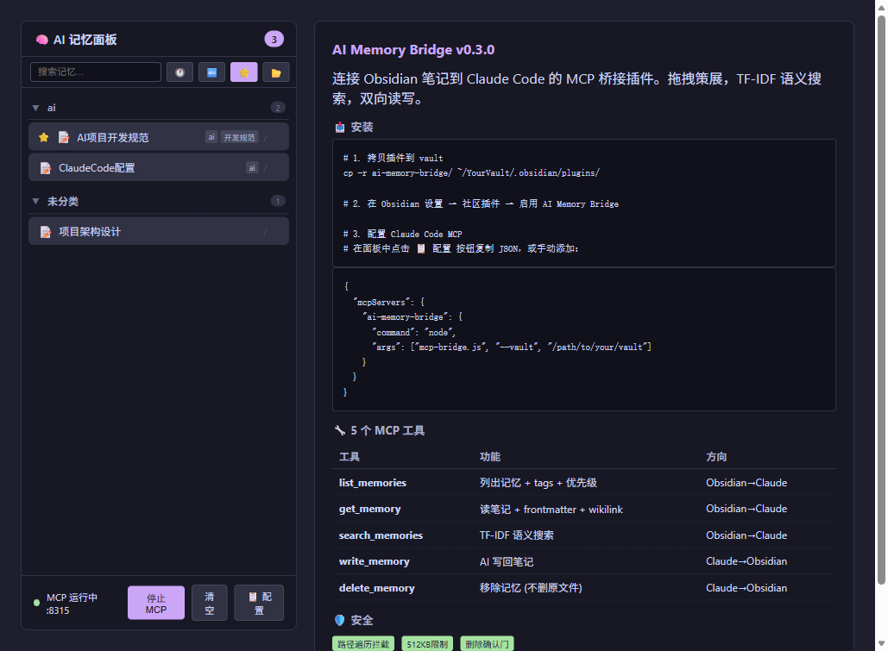

# AI Memory Bridge

> 在 Obsidian 侧栏拖拽笔记，Claude Code 自动记住 — 不需要学 44 个工具，不需要下载模型。



## 这是什么

一个 Obsidian 插件 + MCP Server，把 Obsidian vault 变成 Claude Code 的**长期记忆库**。

在 Obsidian 侧栏打开 AI 记忆面板，拖拽笔记进去，Claude Code 就能通过 5 个 MCP 工具读写你的记忆。

## 和竞品有什么不同

| 我们 | 竞品 |
|------|------|
| 🖱️ **可视化拖拽面板** — 想记什么拖什么 | enquire-mcp: 搜全 vault，无策展 |
| 🔄 **双向读写** — Claude 能写回 Obsidian | 大多数: 只读搜索 |
| 🪶 **5 个工具** — 5 分钟上手 | kobsidian: 66 个工具 |
| 📦 **零外部依赖** — TF-IDF 纯 JS，不下载模型 | enquire-mcp: 需下载 embedding 模型 |
| 🗂️ **AI 记忆隔离** — AI 写的内容放 `AI记忆/` 文件夹 | — |
| 🛡️ **安全** — 路径拦截 + 大小限制 + 删除确认 | — |

## 安装

### 1. 安装插件

```bash
# 拷贝到 Obsidian vault 的插件目录
cp -r ai-memory-bridge/ 你的Vault路径/.obsidian/plugins/ai-memory-bridge/
```

或从 Obsidian 社区市场安装（即将上架）。

### 2. 启用插件

Obsidian → 设置 → 社区插件 → 打开 AI Memory Bridge

### 3. 配置 Claude Code

在 AI Memory Bridge 面板中点击 **📋 配置** 按钮，自动复制 MCP 配置。

或手动添加到 `~/.claude/mcp.json`：

```json
{
  "mcpServers": {
    "ai-memory-bridge": {
      "command": "node",
      "args": ["mcp-bridge.js", "--vault", "/path/to/your/vault"]
    }
  }
}
```

重启 Claude Code 即可使用。

## 使用

### Obsidian 侧

1. 点击 🧠 图标打开 AI 记忆面板
2. 从文件浏览器**拖拽笔记或文件夹**到面板
3. 点击 **启动 MCP** 开启服务
4. 面板支持搜索、排序、按 tags 分组

> 💡 在笔记 frontmatter 中加 `ai_memory: true`，插件会自动发现它。

### Claude Code 侧

| 工具 | 做什么 | 示例 |
|------|--------|------|
| `list_memories` | 查看所有记忆 | 看看有哪些规范文档 |
| `get_memory` | 读一篇笔记 | 读取"AI项目开发规范.md" |
| `search_memories` | 语义搜索 | "MCP 配置怎么配" |
| `write_memory` | 写回 Obsidian | 把技术决策总结写入笔记 |
| `delete_memory` | 移除记忆 | 删除过时的规范 |

## 5 个 MCP 工具

### list_memories
列出所有记忆笔记，含 tags、优先级、字符数。

### get_memory
获取笔记完整内容 + frontmatter 元数据 + `[[wikilink]]` 出链 + 反向链接。支持精确/模糊匹配。

### search_memories
TF-IDF 语义搜索。支持三种模式：
- `semantic`（默认）— 理解同义词和相似概念
- `keyword` — 精确字符串匹配
- `both` — 两者结合

中日韩字符分词，余弦相似度排序。

### write_memory
AI 内容写入 Obsidian。支持：
- `create` — 新建笔记（带 `ai_generated: true` frontmatter）
- `append` — 追加到已有笔记末尾

写入请求排队到 bridge 文件，Obsidian 打开时自动处理。

### delete_memory
从记忆列表移除笔记。**不删除原文件**。需 `confirm: true` 确认。

## 自动发现

在笔记 frontmatter 中加 `ai_memory: true`，插件启动时自动将笔记加入记忆列表：

```yaml
---
ai_memory: true
tags: [ai, 开发规范]
---
```

## 安全

- **路径遍历拦截** — `../` 和绝对路径被拒绝
- **文件大小限制** — 单文件最大 512KB
- **删除确认门** — 破坏性操作需 `confirm: true`

## 开发

```bash
# 安装依赖
npm install

# 类型检查
npx tsc -noEmit -skipLibCheck

# 构建
node esbuild.config.mjs production

# 运行测试
bash tests/run-tests.sh D:/calude/liu2
```

## 项目结构

```
ai-memory-bridge/
├── main.ts              # Obsidian 插件入口
├── mcp-bridge.js        # 独立 MCP Server (stdio)
├── src/
│   ├── BridgeSync.ts    # 数据同步 + 写入处理
│   ├── MemoryStore.ts   # 记忆数据模型
│   ├── MemoryPanel.ts   # 侧栏拖拽面板
│   ├── settings.ts      # 设置页
│   └── utils.ts         # 共享工具函数
├── dev-docs/            # 真源文档 (项目简介/功能/架构/计划)
├── tests/               # 自动化测试 (13 项)
└── assets/              # 截图
```

## License

MIT
